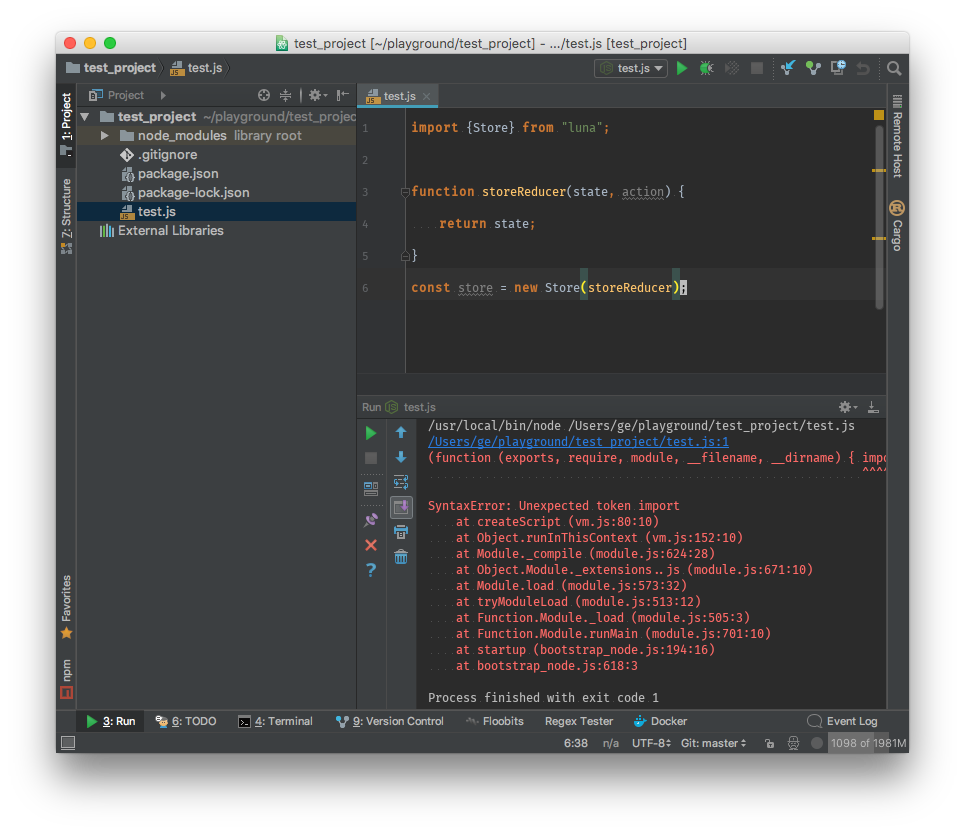
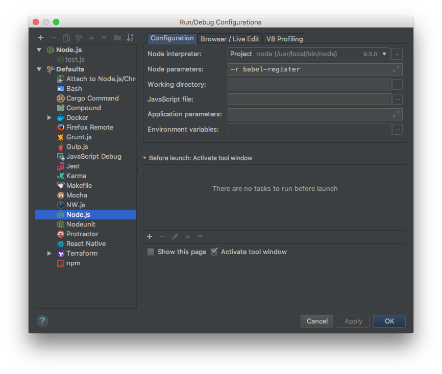

# Setting up ES6 Debugging with JetBrains WebStorm

First try to run the `test.js` script by pressing <kbd>Ctrl</kbd> + <kbd>Shift</kbd> + <kbd>R</kbd> with the `test.js` script open.

And there is this error message:
**Note**: disable ESLint by <kdb>Command</kbd>

The reason this happens is because node can not resolve `es6` module syntax without using michael jackson module.

Like this:

Now everything should run!
